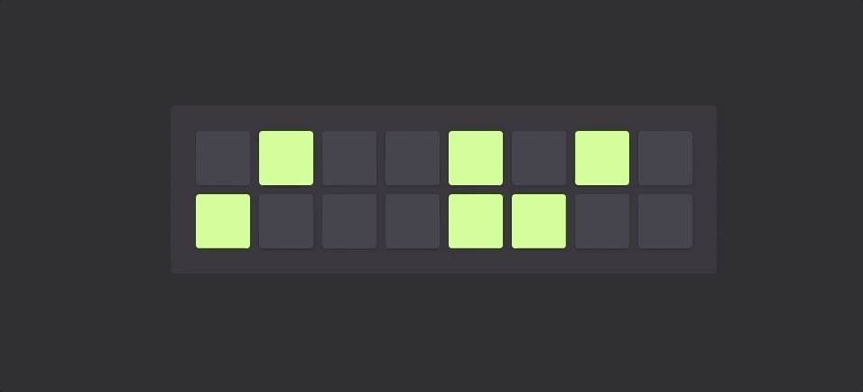

<br>

<p align="center">
  <a href="https://github.com/sam-parsons/react-step-sequencer">
    
  </a>
</p>

<a href="https://sam-parsons.github.io/react-step-sequencer">
  
</a>

<br>
<br>

## Installation

```sh
git clone https://github.com/sam-parsons/react-step-sequencer.git

cd react-step-sequencer/

yarn

yarn start
```

### [Demo](https://sam-parsons.github.io/react-step-sequencer)

## Features

- Variable sequence length
- Variable pitches
- Tap Tempo relies on separate AudioContext timer
  -- works whether sequence is playing or not

## Future Features

- Idiomatic formatting of triple meters
- Measure Sequencing

## License

This project is licensed under the MIT License - see the LICENSE.md file for details.
